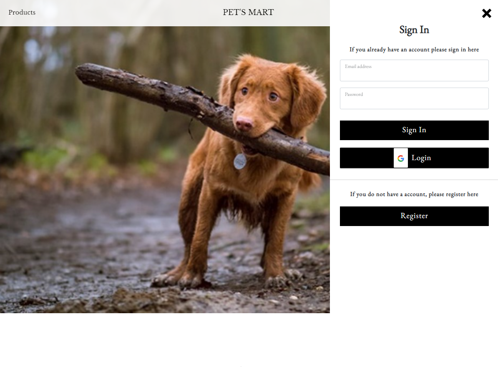

# PET's MART (Golang Server)

##Introduction
This is a code repository for a personal fullstack project on ReactJS eCommerce web Pet Shop application. 

The project implement a complete sample pattern for a real-life eCommerce web application including user login/logout, registration, landing page design, account information and shopping cart and store checkout flow. 

###Landing Page

###Store design

###User Login/Logout & Registration

###Shopping Cart

##Built with
- ReactJS - Used to implement webpage logic, visuals and animations
- Golang - For server implementation at the backend
- GraphQL - API 
- MongoDB - To store user information

## Prerequisite
- Download and install npm  
    A. sudo apt update\
    B. sudo apt install nodejs npm

- Download and install node version 15.6.0\
    A. npm install -g node@15.6.0

- Create an env file and provide the following details\
    A. PORT = 5000 (Database port)\
    B. DATABASE NAME\
    C. SECRETKEY (For encryption of password)\
    D. IV (For encryption of password)\
    E. GOOGLECLIENTID (For 0Auth2 google log in)

- Download and install MongoDB 

- Ensure that localhost port 3000, 5000 and 27017 are available

Note: Please ensure the node version installed is as specified & below version 17 (Important).

## Execution 

1. cd into server folder
2. node server.js - start API server on localhost 5000
3. Start Mongodb - start DB on localhost 27017
4. cd into client folder
5. go go_server

